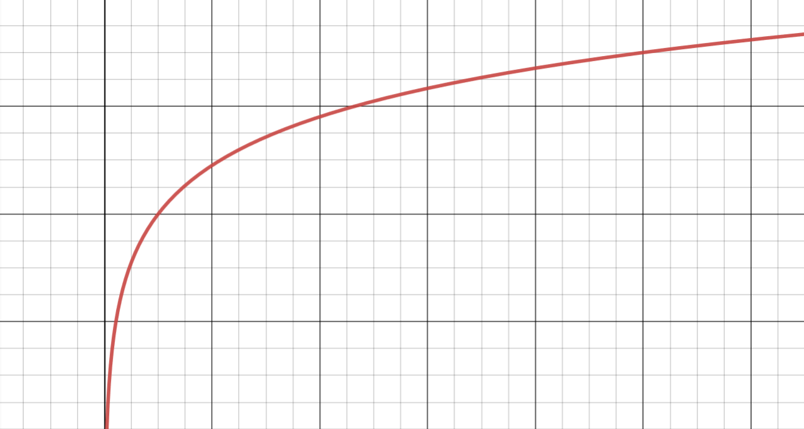

# About MIS Launch

Deciding how to launch Artemis required us to consider a variety of possible choices and their respective outcomes. We have ultimately decided to launch our governance token MIS on our launchpad, the ArtemisPad.

### The reasoning behind our decision

Liquidity mining implies the minting of xToken/Block. Now, say Artemis was to launch MIS with a miniscule supply (relative to xToken/Block), what we then have is an emission schedule based on a logarithmic function, in which inflation based on percentages is incredibly intensive the first days after launch, leading to price volatility and impermanent losses.

On the other hand, the disadvantage of fair launching with a larger supply in an attempt to offset inflation rate, is unfair distribution. This is why we are ultimately launching MIS on our launchpad: a fair solution that serves as a proof of product for the ArtemisPad. Users will be able to deposit Wrapped ONE in return of a share of the MIS allocated to the presale.

## **** **Timeline**

#### **October 5, 10 PM (UTC - **[**https://www.worldtimebuddy.com/**](https://www.worldtimebuddy.com)**)** 

The MIS presale on the ArtemisPad goes live. Artemis Mainnet website will launch \~30 minutes before the presale takes place. 500,000 MIS will be up for grabs over a period of 48hs. We aim to raise $150,000 in ONE tokens, setting the price per MIS to $0.3.

#### **October 7** 

80% of the ONE raised from the presale will be paired to 400,000 MIS tokens, while 20% will be used to cover development costs. Until rewards from Masterchef and Smartchef go live, Artemis' team will verify the contracts on the Harmony Explorer, apply for a Rugdoc review, and burn the MIS-ONE liquidity. Meanwhile, users that participated in the presale will be able to farm with MIS on partnered Harmony yield farms and DEXes.

####  **October 9** 

This is the beginning of our story. [Phase 3](https://app.gitbook.com/@artemisprotocol/s/artemis/\~/drafts/-MlClfs515HuwbxeMaDd/the-protocol/roadmap) 'The Greek Goddess' will go live.

## How to participate

1. Wrap your ONE tokens (A link will be provided both as an announcement and on the platform)
2. Visit the ArtemiPad on Artemis' website (On the Launchpad Tab)
3. Input the amount of WONE you would like to contribute, and do so.
4. You are ready to go! Confirm the transactions and wait until the sale is over.\
